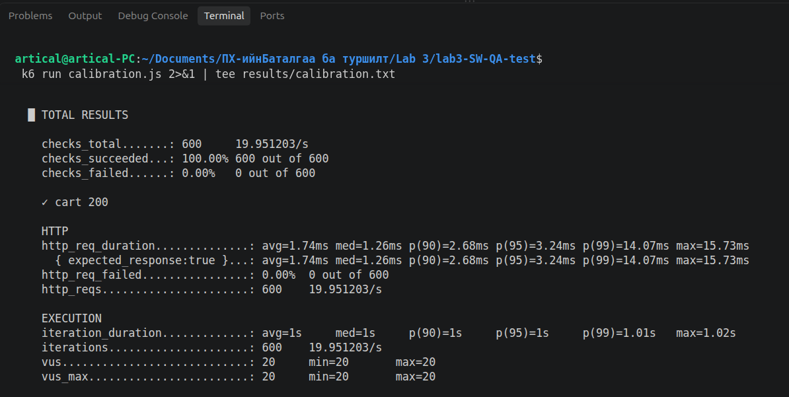
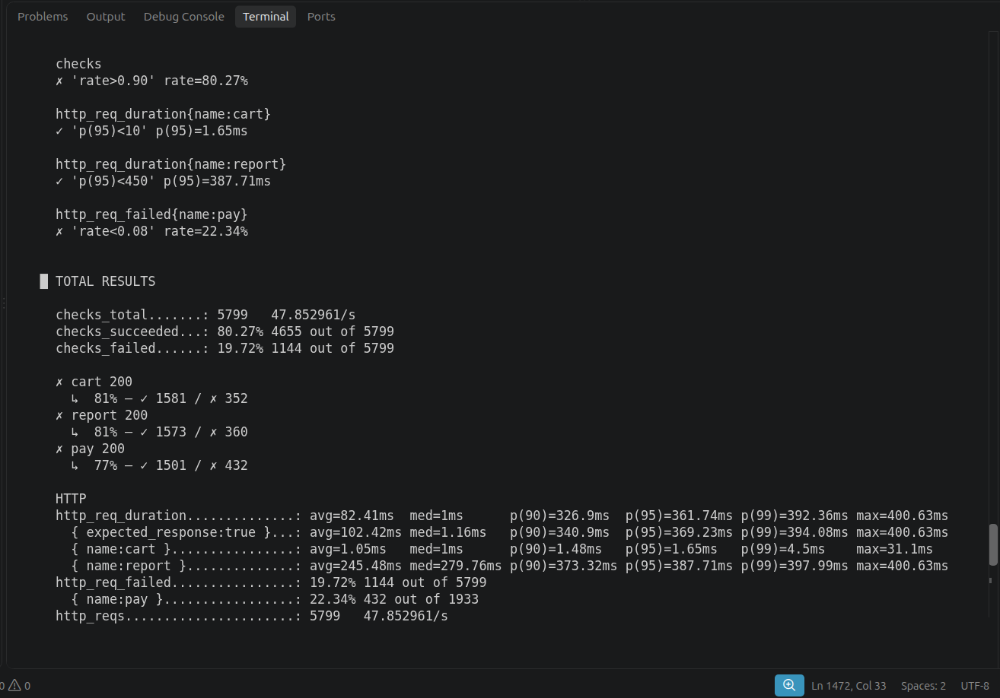
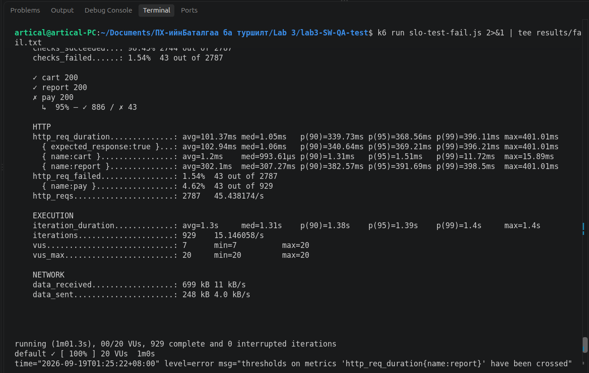

# Лаборатори №3 — Чанарын сценарио → SLO → k6 threshold

## Оюутны мэдээлэл

- **Нэр:** Л.Ирмүүн
- **Оюутны код:** B232270021
- **Хичээл:** F.CSA313 — Программ хангамжийн чанарын баталгаа ба тест

## k6 Version

```text
k6 v2.2.0 (commit/00a9a1b7f5, go1.26.5, linux/amd64)
```

## 1. Лабораторийн зорилго

Энэхүү лабораторийн ажлаар чанарын сценариог хэмжигдэхүйц SLO болгон томьёолж, SLO бүрийг Grafana k6 threshold болгон кодчилж автомат шалгалт хийсэн. Локал Express API дээр performance, reliability, availability гэсэн үндсэн гурван сценарио болон `/report` endpoint-д зориулсан нэмэлт performance сценариог туршсан. Мөн PASS, chaos болон зориуд FAIL болгосон туршилтын бүтэн k6 гаралтыг `results/` хавтаст хадгалсан.

---

## 2. Чанарын сценарионууд

### 2.1 Performance — `/cart/add`

| Хэсэг | Тодорхойлолт |
|---|---|
| **Тойм** | Хэрэглэгч барааг сагсанд нэмэх үед API хурдан хариу өгөх |
| **Системийн төлөв** | Express API хэвийн ажиллаж байна |
| **Орчны төлөв** | 20 VU тогтмол ачаалал, 1 минут |
| **Гадаад өдөөлт** | Зэрэгцээ хэрэглэгчид `POST /cart/add` хүсэлт илгээнэ |
| **Шаардлагатай хариу** | Сервер HTTP 200 болон JSON хариу буцаана |
| **Хэмжүүр** | `/cart/add` latency-ийн **p95 < 10 ms** байна; p99 tail latency-г мөн ажиглана |

### 2.2 Reliability — `/pay`

| Хэсэг | Тодорхойлолт |
|---|---|
| **Тойм** | Төлбөрийн endpoint хэвийн хэрэглээнд хэт олон алдаа гаргахгүй байх |
| **Системийн төлөв** | Express API хэвийн ажиллаж байна |
| **Орчны төлөв** | 20 VU тогтмол ачаалал, 1 минут |
| **Гадаад өдөөлт** | Хэрэглэгч `POST /pay` төлбөрийн хүсэлт илгээнэ |
| **Шаардлагатай хариу** | Төлбөрийн хүсэлтийн ихэнх нь HTTP 200 буцаана |
| **Хэмжүүр** | `/pay` error rate буюу POFOD **8%-иас бага** байна |

### 2.3 Availability — серверийн crash

| Хэсэг | Тодорхойлолт |
|---|---|
| **Тойм** | Сервер түр хугацаанд зогсоод дахин асах үед үйлчилгээний availability-г хэмжих |
| **Системийн төлөв** | k6-ийн 2 минутын тест ажиллаж байна |
| **Орчны төлөв** | 20 VU; тестийн дунд серверийг 10 секунд зориудаар зогсооно |
| **Гадаад өдөөлт** | Express сервер гэнэт зогсоно |
| **Шаардлагатай хариу** | Сервер дахин асмагц хүсэлтүүдийг хэвийн боловсруулж эхэлнэ |
| **Хэмжүүр** | Амжилттай хүсэлтийн хувь **90%-иас их**, сэргээх хугацаа **10 секунд** байна |

### 2.4 Нэмэлт Performance — `/report`

| Хэсэг | Тодорхойлолт |
|---|---|
| **Тойм** | Удаан тайлангийн endpoint-ийн response time-г хянах |
| **Системийн төлөв** | Express API хэвийн ажиллаж байна |
| **Орчны төлөв** | 20 VU тогтмол ачаалал, 1 минут |
| **Гадаад өдөөлт** | Хэрэглэгч `GET /report` хүсэлт илгээнэ |
| **Шаардлагатай хариу** | HTTP 200 болон тайлангийн JSON хариу буцаана |
| **Хэмжүүр** | `/report` latency-ийн **p95 < 450 ms** байна; p99 tail latency-г мөн ажиглана |

---

## 3. SLO

| Сценарио | SLI | Босго | Цонх / нөхцөл |
|---|---|---:|---|
| Performance `/cart/add` | `http_req_duration{name:cart}` p95 | `< 10 ms` | 20 VU, 1 минут |
| Reliability `/pay` | `http_req_failed{name:pay}` | `< 8%` | 20 VU, 1 минут |
| Availability | `checks` буюу амжилттай хүсэлтийн хувь | `> 90%` | 20 VU, 2 минут, 10 секундийн outage |
| Performance `/report` | `http_req_duration{name:report}` p95 | `< 450 ms` | 20 VU, 1 минут |

### 3.1 SLO босго сонгосон үндэслэл

`/cart/add` endpoint-ийн threshold-ийг calibration тестийн бодит хэмжилтэд үндэслэн сонгосон. Calibration тестээр p95 нь **3.24 ms**, p99 нь **14.07 ms** байсан. p95-ийн хэвийн хэлбэлзэлд тодорхой нөөц үлдээхийн тулд p95 босгыг **10 ms** гэж тогтоосон.

`/pay` endpoint нь серверийн кодоор ойролцоогоор 5% HTTP 500 алдаа зориудаар үүсгэдэг тул санамсаргүй хэлбэлзлийн бага хэмжээний нөөцтэйгээр error rate-ийн SLO-г **8%-иас бага** гэж сонгосон.

`/report` endpoint нь 200–400 ms санамсаргүй delay-тэй тул p95 босгыг **450 ms-ээс бага** гэж сонгосон. Ингэснээр endpoint-ийн зориудаар өгсөн саатлыг зөвшөөрөх боловч хэвийн хэмжээнээс хэтэрсэн удаашралыг илрүүлэх боломжтой.

Availability SLO-г **90%-иас их** байхаар тогтоосон. 2 минутын туршилтын цонхонд энэ нь 10%-ийн error budget зөвшөөрнө.

### 3.2 Availability error budget

Туршилтын хугацаа:

```text
2 минут = 120 секунд
```

Availability SLO:

```text
90%
```

Хугацаанд суурилсан error budget:

```text
120 секунд × (1 - 0.90)
= 120 × 0.10
= 12 секунд
```

Chaos туршилтын event timestamp:

```text
server_stopped=2026-09-19T02:04:43+08:00
server_restarted=2026-09-19T02:04:53+08:00
```

Иймээс серверийн бодит зогсолт **10 секунд** байсан. Энэ нь хугацаанд суурилсан **12 секундийн error budget** дотор багтаж байна.

---

## 4. Calibration тест

`/cart/add` endpoint-ийн бодит latency-г эхлээд 20 VU, 30 секундийн calibration тестээр хэмжсэн.

| Үзүүлэлт | Бодит үр дүн |
|---|---:|
| p90 | 2.68 ms |
| p95 | 3.24 ms |
| p99 | 14.07 ms |
| Max | 15.73 ms |
| Error rate | 0.00% |

Calibration-ийн бүтэн гаралт:

- [`results/calibration.txt`](results/calibration.txt)

---

## 5. PASS тестийн үр дүн

PASS туршилтыг `slo-test.js` ашиглан 20 VU, 1 минут ажиллуулсан.

| Үзүүлэлт | SLO | Бодит үр дүн | Статус |
|---|---:|---:|---|
| `/cart/add` p95 | `< 10 ms` | **1.76 ms** | PASS |
| `/cart/add` p99 | Ажиглалт | **33.97 ms** | — |
| `/pay` error rate | `< 8%` | **6.20%** | PASS |
| Availability `checks` | `> 90%` | **97.93%** | PASS |
| `/report` p95 | `< 450 ms` | **392.20 ms** | PASS |
| `/report` p99 | Ажиглалт | **399.03 ms** | — |

Threshold summary:

```text
checks                           rate>0.90   → 97.93%   PASS
http_req_duration{name:cart}     p(95)<10    → 1.76ms   PASS
http_req_duration{name:report}   p(95)<450   → 392.2ms  PASS
http_req_failed{name:pay}        rate<0.08   → 6.20%    PASS
```

PASS тестийн exit code:

```text
exit=0
```

Бүтэн гаралт:

- [`results/pass.txt`](results/pass.txt)

---

## 6. Chaos туршилт

Chaos туршилтыг `slo-test.js` ашиглан 20 VU, 2 минут ажиллуулсан. Тестийн явцад Express серверийг **10 секунд** зориудаар зогсоогоод дахин асаасан.

### 6.1 Chaos хэмжилт

| Үзүүлэлт | SLO | Бодит үр дүн | Статус |
|---|---:|---:|---|
| `/cart/add` p95 | `< 10 ms` | **1.73 ms** | PASS |
| `/cart/add` p99 | Ажиглалт | **4.96 ms** | — |
| `/report` p95 | `< 450 ms` | **391.40 ms** | PASS |
| `/report` p99 | Ажиглалт | **398.71 ms** | — |
| `/pay` error rate | `< 8%` | **16.47%** | FAIL |
| Request-based availability (`checks`) | `> 90%` | **86.68%** | FAIL |
| Амжилттай checks | — | **4941** | — |
| Нийт checks | — | **5700** | — |
| Failed checks | — | **759** | — |
| Planned downtime | — | **10 секунд** | — |
| Time-based error budget | — | **12 секунд** | PASS |

Chaos threshold summary:

```text
checks                           rate>0.90   → 86.68%   FAIL
http_req_duration{name:cart}     p(95)<10    → 1.73ms   PASS
http_req_duration{name:report}   p(95)<450   → 391.4ms  PASS
http_req_failed{name:pay}        rate<0.08   → 16.47%   FAIL
```

### 6.2 Request-based availability

Бодит availability:

```text
4941 / 5700 × 100
= 86.68%
```

90%-ийн availability SLO үед request-based error budget нь нийт хүсэлтийн 10% байна:

```text
5700 × 0.10
= 570 хүсэлт
```

Бодит failed checks:

```text
5700 - 4941
= 759 хүсэлт
```

Харьцуулалт:

```text
Actual failed checks = 759
Error budget         = 570

759 > 570
```

Иймээс **request-based error budget 189 хүсэлтээр хэтэрсэн**.

`checks > 90%` гэдэг нь strict threshold учраас яг 90.00% байсан ч PASS болохгүй. Гэхдээ энэ туршилтад 86.68% гарсан тул availability SLO зөрчигдсөн.

### 6.3 Яагаад 10 секундийн outage байхад request-based availability 90%-аас доош орсон бэ?

Хэвийн үед `/report` endpoint 200–400 ms хүлээлгэдэг. Харин сервер унтарсан үед хүсэлтүүд `connection refused` байдлаар маш хурдан амжилтгүй буцдаг. Иймээс outage-ийн нэг секундэд хэвийн ажиллаж байгаа нэг секундээс илүү олон failed request бүртгэгдэх боломжтой.

Мөн `/pay` endpoint хэвийн үедээ өөрөө ойролцоогоор 5% HTTP 500 алдаа зориудаар үүсгэдэг. Тиймээс хугацаанд суурилсан availability болон хүсэлтээр тооцсон availability хоёр заавал ижил гарахгүй. Энэ туршилтаар 10 секундийн outage нь 12 секундийн time-based error budget дотор багтсан боловч request-based availability **86.68%** болж SLO-г хангаагүй.

### 6.4 Availability болон Reliability яагаад зэрэг FAIL болсон бэ?

Сервер унтарсан үед `/cart/add`, `/report`, `/pay` бүх хүсэлт connection failure-д орсон. Иймээс outage нь нийт `checks`-ийн амжилтын хувийг бууруулж availability SLO-г FAIL болгосноос гадна `http_req_failed{name:pay}`-ийг өсгөж reliability SLO-г мөн FAIL болгосон.

```text
Availability    = 86.68%  → FAIL
/pay error rate = 16.47%  → FAIL
```

Availability болон payment reliability-г илүү сайн тусгаарлах шаардлагатай бол availability-г dedicated health endpoint эсвэл service reachability хэмжүүрээр, харин `/pay` endpoint-ийн HTTP 500 алдааг тусдаа reliability SLI болгон хэмжиж болно.

Chaos-ийн бүтэн гаралт болон event timestamps:

- [`results/chaos.txt`](results/chaos.txt)
- [`results/chaos-events.txt`](results/chaos-events.txt)

---

## 7. Зориуд FAIL болгосон threshold тест

Threshold-ийн FAIL ажиллагааг баталгаажуулахын тулд `slo-test-fail.js` файлд `/report` endpoint-ийн threshold-ийг зориудаар:

```text
p(95) < 100 ms
```

болгосон.

`/report` endpoint серверийн кодоор 200–400 ms delay-тэй учраас энэ threshold найдвартай FAIL болох нөхцөлтэй.

FAIL туршилтын бодит үр дүн:

| Үзүүлэлт | Threshold | Бодит үр дүн | Статус |
|---|---:|---:|---|
| `checks` | `> 90%` | **98.45%** | PASS |
| `/cart/add` p95 | `< 10 ms` | **1.51 ms** | PASS |
| `/cart/add` p99 | Ажиглалт | **11.72 ms** | — |
| `/pay` error rate | `< 8%` | **4.62%** | PASS |
| `/report` p95 | `< 100 ms` | **391.69 ms** | **FAIL** |
| `/report` p99 | Ажиглалт | **398.50 ms** | — |

Threshold summary:

```text
checks                           rate>0.90   → 98.45%    PASS
http_req_duration{name:cart}     p(95)<10    → 1.51ms    PASS
http_req_duration{name:report}   p(95)<100   → 391.69ms  FAIL
http_req_failed{name:pay}        rate<0.08   → 4.62%     PASS
```

k6-ийн exit code:

```text
exit=99
```

`exit=99` нь non-zero exit code тул threshold failure автоматаар илэрснийг харуулна. CI pipeline дээр ийм exit code-оор build эсвэл deployment-ийг зогсоох quality gate хэрэгжүүлэх боломжтой.

Бүтэн гаралт:

- [`results/fail.txt`](results/fail.txt)

---

## 8. PASS, Chaos, FAIL туршилтын нэгтгэл

| Туршилт | `/cart/add` | `/pay` | Availability | `/report` | Ерөнхий үр дүн |
|---|---|---|---|---|---|
| PASS | PASS | PASS | PASS | PASS | Бүх SLO PASS |
| Chaos | PASS | FAIL — 16.47% | FAIL — 86.68% | PASS | Reliability ба Availability SLO зөрчсөн |
| Intentional FAIL | PASS | PASS | PASS | FAIL — 391.69 ms > 100 ms | FAIL, `exit=99` |

---

## 9. Screenshots

### PASS



### Chaos



### FAIL



---

## 10. k6 бүтэн гаралтын файлууд

- [Calibration output](results/calibration.txt)
- [PASS output](results/pass.txt)
- [Chaos output](results/chaos.txt)
- [FAIL output](results/fail.txt)
- [Chaos event timestamps](results/chaos-events.txt)

---

## 11. Дүгнэлт

1. Энэхүү лабораторийн ажлаар чанарын сценариог хэмжигдэхүйц SLO болгон хувиргаж, дараа нь k6 threshold болгон автомат шалгалт хийх процессыг хэрэгжүүлсэн.
2. Performance сценариод `/cart/add` endpoint-ийн calibration p95 болох 3.24 ms хэмжилтэд үндэслэн p95 latency-ийн SLO-г 10 ms-ээс бага гэж сонгосон.
3. Reliability сценариод `/pay` endpoint зориудаар ойролцоогоор 5% алдаа үүсгэдэг тул error rate-ийн SLO-г 8%-иас бага байхаар тодорхойлсон бөгөөд PASS тестийн бодит үр дүн 6.20% байсан.
4. `/report` endpoint 200–400 ms delay-тэй тул p95 босгыг 450 ms гэж сонгосон бөгөөд PASS тестээр бодит p95 нь 392.20 ms гарч SLO-г хангасан.
5. PASS туршилтаар `/cart/add`, `/pay`, availability болон `/report` гэсэн бүх threshold хангагдсан.
6. Chaos туршилтаар серверийг яг 10 секунд зогсооход request-based availability 86.68% болж 90%-ийн SLO-г хангаагүй, `/pay` error rate 16.47% болж reliability SLO мөн зөрчигдсөн.
7. Хугацаанд суурилсан 12 секундийн error budget дотор 10 секундийн outage багтсан боловч 759 failed check нь request-based 570 failure budget-ээс их байсан тул хүсэлтэд суурилсан error budget хэтэрсэн.
8. Энэ ялгаа нь сервер унтарсан үед `connection refused` хүсэлтүүд хэвийн `/report` хүсэлтээс хурдан дуусаж, богино хугацаанд олон failed request бүртгэгддэгтэй холбоотой.
9. `/report` threshold-ийг зориудаар p95 < 100 ms болгосноор тест FAIL болж `exit=99` non-zero code буцаасан нь k6 threshold-ийг CI/CD quality gate болгон ашиглах боломжтойг харуулсан.
10. Энэ лабораториор чанарын шаардлагыг зөвхөн тайлбар хэлбэрээр бус, хэмжигдэхүйц сценарио, SLO, error budget болон автомат threshold болгон боловсруулах нь чухал болохыг ойлгосон.